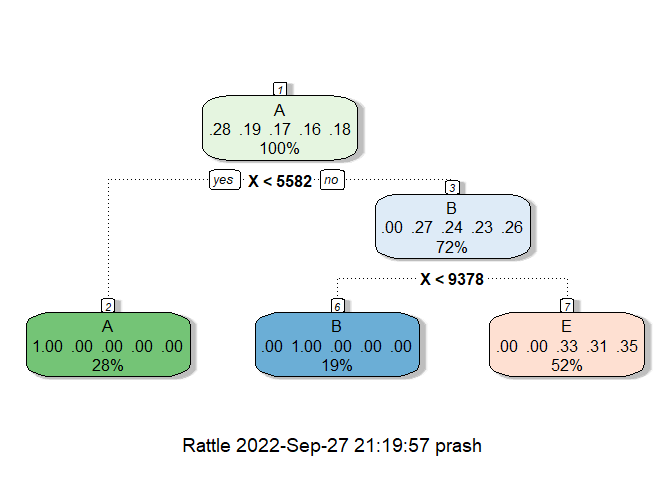

### Background

Using devices such as Jawbone Up, Nike FuelBand, and Fitbit it is now
possible to collect a large amount of data about personal activity
relatively inexpensively. These type of devices are part of the
quantified self movement – a group of enthusiasts who take measurements
about themselves regularly to improve their health, to find patterns in
their behavior, or because they are tech geeks. One thing that people
regularly do is quantify how much of a particular activity they do, but
they rarely quantify how well they do it. In this project, your goal
will be to use data from accelerometers on the belt, forearm, arm, and
dumbell of 6 participants. They were asked to perform barbell lifts
correctly and incorrectly in 5 different ways. More information is
available from the website here:
<http://web.archive.org/web/20161224072740/http:/groupware.les.inf.puc-rio.br/har>.

### Data

The training data for this project are available here:

<https://d396qusza40orc.cloudfront.net/predmachlearn/pml-training.csv>

The test data are available here:

<https://d396qusza40orc.cloudfront.net/predmachlearn/pml-testing.csv>

### Loading libraries

    library(caret)

    ## Loading required package: ggplot2

    ## Loading required package: lattice

    library(rattle)

    ## Loading required package: tibble

    ## Loading required package: bitops

    ## Rattle: A free graphical interface for data science with R.
    ## Version 5.5.1 Copyright (c) 2006-2021 Togaware Pty Ltd.
    ## Type 'rattle()' to shake, rattle, and roll your data.

    library(knitr)
    library(randomForest)

    ## randomForest 4.7-1.1

    ## Type rfNews() to see new features/changes/bug fixes.

    ## 
    ## Attaching package: 'randomForest'

    ## The following object is masked from 'package:rattle':
    ## 
    ##     importance

    ## The following object is masked from 'package:ggplot2':
    ## 
    ##     margin

### Loading datasets

Loading the training and the testing data into `df_train` and `df_test`
with the setting that any instances of `NA` and `""` will be considered
as `NA`.

    df_train <- read.csv('pml-training.csv', na.strings = c("NA", ""))
    df_test <- read.csv('pml-testing.csv', na.strings = c("NA", ""))

Checking the dimensions of the training and testing data:

    dim(df_train)

    ## [1] 19622   160

    dim(df_test)

    ## [1]  20 160

Checking out the names of the columns in the dataset:

    names(df_train)

    ##   [1] "X"                        "user_name"               
    ##   [3] "raw_timestamp_part_1"     "raw_timestamp_part_2"    
    ##   [5] "cvtd_timestamp"           "new_window"              
    ##   [7] "num_window"               "roll_belt"               
    ##   [9] "pitch_belt"               "yaw_belt"                
    ##  [11] "total_accel_belt"         "kurtosis_roll_belt"      
    ##  [13] "kurtosis_picth_belt"      "kurtosis_yaw_belt"       
    ##  [15] "skewness_roll_belt"       "skewness_roll_belt.1"    
    ##  [17] "skewness_yaw_belt"        "max_roll_belt"           
    ##  [19] "max_picth_belt"           "max_yaw_belt"            
    ##  [21] "min_roll_belt"            "min_pitch_belt"          
    ##  [23] "min_yaw_belt"             "amplitude_roll_belt"     
    ##  [25] "amplitude_pitch_belt"     "amplitude_yaw_belt"      
    ##  [27] "var_total_accel_belt"     "avg_roll_belt"           
    ##  [29] "stddev_roll_belt"         "var_roll_belt"           
    ##  [31] "avg_pitch_belt"           "stddev_pitch_belt"       
    ##  [33] "var_pitch_belt"           "avg_yaw_belt"            
    ##  [35] "stddev_yaw_belt"          "var_yaw_belt"            
    ##  [37] "gyros_belt_x"             "gyros_belt_y"            
    ##  [39] "gyros_belt_z"             "accel_belt_x"            
    ##  [41] "accel_belt_y"             "accel_belt_z"            
    ##  [43] "magnet_belt_x"            "magnet_belt_y"           
    ##  [45] "magnet_belt_z"            "roll_arm"                
    ##  [47] "pitch_arm"                "yaw_arm"                 
    ##  [49] "total_accel_arm"          "var_accel_arm"           
    ##  [51] "avg_roll_arm"             "stddev_roll_arm"         
    ##  [53] "var_roll_arm"             "avg_pitch_arm"           
    ##  [55] "stddev_pitch_arm"         "var_pitch_arm"           
    ##  [57] "avg_yaw_arm"              "stddev_yaw_arm"          
    ##  [59] "var_yaw_arm"              "gyros_arm_x"             
    ##  [61] "gyros_arm_y"              "gyros_arm_z"             
    ##  [63] "accel_arm_x"              "accel_arm_y"             
    ##  [65] "accel_arm_z"              "magnet_arm_x"            
    ##  [67] "magnet_arm_y"             "magnet_arm_z"            
    ##  [69] "kurtosis_roll_arm"        "kurtosis_picth_arm"      
    ##  [71] "kurtosis_yaw_arm"         "skewness_roll_arm"       
    ##  [73] "skewness_pitch_arm"       "skewness_yaw_arm"        
    ##  [75] "max_roll_arm"             "max_picth_arm"           
    ##  [77] "max_yaw_arm"              "min_roll_arm"            
    ##  [79] "min_pitch_arm"            "min_yaw_arm"             
    ##  [81] "amplitude_roll_arm"       "amplitude_pitch_arm"     
    ##  [83] "amplitude_yaw_arm"        "roll_dumbbell"           
    ##  [85] "pitch_dumbbell"           "yaw_dumbbell"            
    ##  [87] "kurtosis_roll_dumbbell"   "kurtosis_picth_dumbbell" 
    ##  [89] "kurtosis_yaw_dumbbell"    "skewness_roll_dumbbell"  
    ##  [91] "skewness_pitch_dumbbell"  "skewness_yaw_dumbbell"   
    ##  [93] "max_roll_dumbbell"        "max_picth_dumbbell"      
    ##  [95] "max_yaw_dumbbell"         "min_roll_dumbbell"       
    ##  [97] "min_pitch_dumbbell"       "min_yaw_dumbbell"        
    ##  [99] "amplitude_roll_dumbbell"  "amplitude_pitch_dumbbell"
    ## [101] "amplitude_yaw_dumbbell"   "total_accel_dumbbell"    
    ## [103] "var_accel_dumbbell"       "avg_roll_dumbbell"       
    ## [105] "stddev_roll_dumbbell"     "var_roll_dumbbell"       
    ## [107] "avg_pitch_dumbbell"       "stddev_pitch_dumbbell"   
    ## [109] "var_pitch_dumbbell"       "avg_yaw_dumbbell"        
    ## [111] "stddev_yaw_dumbbell"      "var_yaw_dumbbell"        
    ## [113] "gyros_dumbbell_x"         "gyros_dumbbell_y"        
    ## [115] "gyros_dumbbell_z"         "accel_dumbbell_x"        
    ## [117] "accel_dumbbell_y"         "accel_dumbbell_z"        
    ## [119] "magnet_dumbbell_x"        "magnet_dumbbell_y"       
    ## [121] "magnet_dumbbell_z"        "roll_forearm"            
    ## [123] "pitch_forearm"            "yaw_forearm"             
    ## [125] "kurtosis_roll_forearm"    "kurtosis_picth_forearm"  
    ## [127] "kurtosis_yaw_forearm"     "skewness_roll_forearm"   
    ## [129] "skewness_pitch_forearm"   "skewness_yaw_forearm"    
    ## [131] "max_roll_forearm"         "max_picth_forearm"       
    ## [133] "max_yaw_forearm"          "min_roll_forearm"        
    ## [135] "min_pitch_forearm"        "min_yaw_forearm"         
    ## [137] "amplitude_roll_forearm"   "amplitude_pitch_forearm" 
    ## [139] "amplitude_yaw_forearm"    "total_accel_forearm"     
    ## [141] "var_accel_forearm"        "avg_roll_forearm"        
    ## [143] "stddev_roll_forearm"      "var_roll_forearm"        
    ## [145] "avg_pitch_forearm"        "stddev_pitch_forearm"    
    ## [147] "var_pitch_forearm"        "avg_yaw_forearm"         
    ## [149] "stddev_yaw_forearm"       "var_yaw_forearm"         
    ## [151] "gyros_forearm_x"          "gyros_forearm_y"         
    ## [153] "gyros_forearm_z"          "accel_forearm_x"         
    ## [155] "accel_forearm_y"          "accel_forearm_z"         
    ## [157] "magnet_forearm_x"         "magnet_forearm_y"        
    ## [159] "magnet_forearm_z"         "classe"

The name of the target column is `classe`.

### Data Splitting

Splitting the `df_train` into training and validation sets for **cross
validation**:

    train_idx <- createDataPartition(df_train$classe, p = 0.7, list = FALSE)
    X_val <- df_train[-train_idx, ]
    df_train <- df_train[train_idx, ]

Checking out the dimensions of these datasets:

    dim(df_train)

    ## [1] 13737   160

    dim(X_val)

    ## [1] 5885  160

### Data Preprocessing

Checking for the instances of missing values:

    colSums(is.na(df_train))

    ##                        X                user_name     raw_timestamp_part_1 
    ##                        0                        0                        0 
    ##     raw_timestamp_part_2           cvtd_timestamp               new_window 
    ##                        0                        0                        0 
    ##               num_window                roll_belt               pitch_belt 
    ##                        0                        0                        0 
    ##                 yaw_belt         total_accel_belt       kurtosis_roll_belt 
    ##                        0                        0                    13445 
    ##      kurtosis_picth_belt        kurtosis_yaw_belt       skewness_roll_belt 
    ##                    13445                    13445                    13445 
    ##     skewness_roll_belt.1        skewness_yaw_belt            max_roll_belt 
    ##                    13445                    13445                    13445 
    ##           max_picth_belt             max_yaw_belt            min_roll_belt 
    ##                    13445                    13445                    13445 
    ##           min_pitch_belt             min_yaw_belt      amplitude_roll_belt 
    ##                    13445                    13445                    13445 
    ##     amplitude_pitch_belt       amplitude_yaw_belt     var_total_accel_belt 
    ##                    13445                    13445                    13445 
    ##            avg_roll_belt         stddev_roll_belt            var_roll_belt 
    ##                    13445                    13445                    13445 
    ##           avg_pitch_belt        stddev_pitch_belt           var_pitch_belt 
    ##                    13445                    13445                    13445 
    ##             avg_yaw_belt          stddev_yaw_belt             var_yaw_belt 
    ##                    13445                    13445                    13445 
    ##             gyros_belt_x             gyros_belt_y             gyros_belt_z 
    ##                        0                        0                        0 
    ##             accel_belt_x             accel_belt_y             accel_belt_z 
    ##                        0                        0                        0 
    ##            magnet_belt_x            magnet_belt_y            magnet_belt_z 
    ##                        0                        0                        0 
    ##                 roll_arm                pitch_arm                  yaw_arm 
    ##                        0                        0                        0 
    ##          total_accel_arm            var_accel_arm             avg_roll_arm 
    ##                        0                    13445                    13445 
    ##          stddev_roll_arm             var_roll_arm            avg_pitch_arm 
    ##                    13445                    13445                    13445 
    ##         stddev_pitch_arm            var_pitch_arm              avg_yaw_arm 
    ##                    13445                    13445                    13445 
    ##           stddev_yaw_arm              var_yaw_arm              gyros_arm_x 
    ##                    13445                    13445                        0 
    ##              gyros_arm_y              gyros_arm_z              accel_arm_x 
    ##                        0                        0                        0 
    ##              accel_arm_y              accel_arm_z             magnet_arm_x 
    ##                        0                        0                        0 
    ##             magnet_arm_y             magnet_arm_z        kurtosis_roll_arm 
    ##                        0                        0                    13445 
    ##       kurtosis_picth_arm         kurtosis_yaw_arm        skewness_roll_arm 
    ##                    13445                    13445                    13445 
    ##       skewness_pitch_arm         skewness_yaw_arm             max_roll_arm 
    ##                    13445                    13445                    13445 
    ##            max_picth_arm              max_yaw_arm             min_roll_arm 
    ##                    13445                    13445                    13445 
    ##            min_pitch_arm              min_yaw_arm       amplitude_roll_arm 
    ##                    13445                    13445                    13445 
    ##      amplitude_pitch_arm        amplitude_yaw_arm            roll_dumbbell 
    ##                    13445                    13445                        0 
    ##           pitch_dumbbell             yaw_dumbbell   kurtosis_roll_dumbbell 
    ##                        0                        0                    13445 
    ##  kurtosis_picth_dumbbell    kurtosis_yaw_dumbbell   skewness_roll_dumbbell 
    ##                    13445                    13445                    13445 
    ##  skewness_pitch_dumbbell    skewness_yaw_dumbbell        max_roll_dumbbell 
    ##                    13445                    13445                    13445 
    ##       max_picth_dumbbell         max_yaw_dumbbell        min_roll_dumbbell 
    ##                    13445                    13445                    13445 
    ##       min_pitch_dumbbell         min_yaw_dumbbell  amplitude_roll_dumbbell 
    ##                    13445                    13445                    13445 
    ## amplitude_pitch_dumbbell   amplitude_yaw_dumbbell     total_accel_dumbbell 
    ##                    13445                    13445                        0 
    ##       var_accel_dumbbell        avg_roll_dumbbell     stddev_roll_dumbbell 
    ##                    13445                    13445                    13445 
    ##        var_roll_dumbbell       avg_pitch_dumbbell    stddev_pitch_dumbbell 
    ##                    13445                    13445                    13445 
    ##       var_pitch_dumbbell         avg_yaw_dumbbell      stddev_yaw_dumbbell 
    ##                    13445                    13445                    13445 
    ##         var_yaw_dumbbell         gyros_dumbbell_x         gyros_dumbbell_y 
    ##                    13445                        0                        0 
    ##         gyros_dumbbell_z         accel_dumbbell_x         accel_dumbbell_y 
    ##                        0                        0                        0 
    ##         accel_dumbbell_z        magnet_dumbbell_x        magnet_dumbbell_y 
    ##                        0                        0                        0 
    ##        magnet_dumbbell_z             roll_forearm            pitch_forearm 
    ##                        0                        0                        0 
    ##              yaw_forearm    kurtosis_roll_forearm   kurtosis_picth_forearm 
    ##                        0                    13445                    13445 
    ##     kurtosis_yaw_forearm    skewness_roll_forearm   skewness_pitch_forearm 
    ##                    13445                    13445                    13445 
    ##     skewness_yaw_forearm         max_roll_forearm        max_picth_forearm 
    ##                    13445                    13445                    13445 
    ##          max_yaw_forearm         min_roll_forearm        min_pitch_forearm 
    ##                    13445                    13445                    13445 
    ##          min_yaw_forearm   amplitude_roll_forearm  amplitude_pitch_forearm 
    ##                    13445                    13445                    13445 
    ##    amplitude_yaw_forearm      total_accel_forearm        var_accel_forearm 
    ##                    13445                        0                    13445 
    ##         avg_roll_forearm      stddev_roll_forearm         var_roll_forearm 
    ##                    13445                    13445                    13445 
    ##        avg_pitch_forearm     stddev_pitch_forearm        var_pitch_forearm 
    ##                    13445                    13445                    13445 
    ##          avg_yaw_forearm       stddev_yaw_forearm          var_yaw_forearm 
    ##                    13445                    13445                    13445 
    ##          gyros_forearm_x          gyros_forearm_y          gyros_forearm_z 
    ##                        0                        0                        0 
    ##          accel_forearm_x          accel_forearm_y          accel_forearm_z 
    ##                        0                        0                        0 
    ##         magnet_forearm_x         magnet_forearm_y         magnet_forearm_z 
    ##                        0                        0                        0 
    ##                   classe 
    ##                        0

Many columns tend to have missing values.  
Checking what percentage of data is missing in these columns:

    colMeans(is.na(df_train))

    ##                        X                user_name     raw_timestamp_part_1 
    ##                0.0000000                0.0000000                0.0000000 
    ##     raw_timestamp_part_2           cvtd_timestamp               new_window 
    ##                0.0000000                0.0000000                0.0000000 
    ##               num_window                roll_belt               pitch_belt 
    ##                0.0000000                0.0000000                0.0000000 
    ##                 yaw_belt         total_accel_belt       kurtosis_roll_belt 
    ##                0.0000000                0.0000000                0.9787435 
    ##      kurtosis_picth_belt        kurtosis_yaw_belt       skewness_roll_belt 
    ##                0.9787435                0.9787435                0.9787435 
    ##     skewness_roll_belt.1        skewness_yaw_belt            max_roll_belt 
    ##                0.9787435                0.9787435                0.9787435 
    ##           max_picth_belt             max_yaw_belt            min_roll_belt 
    ##                0.9787435                0.9787435                0.9787435 
    ##           min_pitch_belt             min_yaw_belt      amplitude_roll_belt 
    ##                0.9787435                0.9787435                0.9787435 
    ##     amplitude_pitch_belt       amplitude_yaw_belt     var_total_accel_belt 
    ##                0.9787435                0.9787435                0.9787435 
    ##            avg_roll_belt         stddev_roll_belt            var_roll_belt 
    ##                0.9787435                0.9787435                0.9787435 
    ##           avg_pitch_belt        stddev_pitch_belt           var_pitch_belt 
    ##                0.9787435                0.9787435                0.9787435 
    ##             avg_yaw_belt          stddev_yaw_belt             var_yaw_belt 
    ##                0.9787435                0.9787435                0.9787435 
    ##             gyros_belt_x             gyros_belt_y             gyros_belt_z 
    ##                0.0000000                0.0000000                0.0000000 
    ##             accel_belt_x             accel_belt_y             accel_belt_z 
    ##                0.0000000                0.0000000                0.0000000 
    ##            magnet_belt_x            magnet_belt_y            magnet_belt_z 
    ##                0.0000000                0.0000000                0.0000000 
    ##                 roll_arm                pitch_arm                  yaw_arm 
    ##                0.0000000                0.0000000                0.0000000 
    ##          total_accel_arm            var_accel_arm             avg_roll_arm 
    ##                0.0000000                0.9787435                0.9787435 
    ##          stddev_roll_arm             var_roll_arm            avg_pitch_arm 
    ##                0.9787435                0.9787435                0.9787435 
    ##         stddev_pitch_arm            var_pitch_arm              avg_yaw_arm 
    ##                0.9787435                0.9787435                0.9787435 
    ##           stddev_yaw_arm              var_yaw_arm              gyros_arm_x 
    ##                0.9787435                0.9787435                0.0000000 
    ##              gyros_arm_y              gyros_arm_z              accel_arm_x 
    ##                0.0000000                0.0000000                0.0000000 
    ##              accel_arm_y              accel_arm_z             magnet_arm_x 
    ##                0.0000000                0.0000000                0.0000000 
    ##             magnet_arm_y             magnet_arm_z        kurtosis_roll_arm 
    ##                0.0000000                0.0000000                0.9787435 
    ##       kurtosis_picth_arm         kurtosis_yaw_arm        skewness_roll_arm 
    ##                0.9787435                0.9787435                0.9787435 
    ##       skewness_pitch_arm         skewness_yaw_arm             max_roll_arm 
    ##                0.9787435                0.9787435                0.9787435 
    ##            max_picth_arm              max_yaw_arm             min_roll_arm 
    ##                0.9787435                0.9787435                0.9787435 
    ##            min_pitch_arm              min_yaw_arm       amplitude_roll_arm 
    ##                0.9787435                0.9787435                0.9787435 
    ##      amplitude_pitch_arm        amplitude_yaw_arm            roll_dumbbell 
    ##                0.9787435                0.9787435                0.0000000 
    ##           pitch_dumbbell             yaw_dumbbell   kurtosis_roll_dumbbell 
    ##                0.0000000                0.0000000                0.9787435 
    ##  kurtosis_picth_dumbbell    kurtosis_yaw_dumbbell   skewness_roll_dumbbell 
    ##                0.9787435                0.9787435                0.9787435 
    ##  skewness_pitch_dumbbell    skewness_yaw_dumbbell        max_roll_dumbbell 
    ##                0.9787435                0.9787435                0.9787435 
    ##       max_picth_dumbbell         max_yaw_dumbbell        min_roll_dumbbell 
    ##                0.9787435                0.9787435                0.9787435 
    ##       min_pitch_dumbbell         min_yaw_dumbbell  amplitude_roll_dumbbell 
    ##                0.9787435                0.9787435                0.9787435 
    ## amplitude_pitch_dumbbell   amplitude_yaw_dumbbell     total_accel_dumbbell 
    ##                0.9787435                0.9787435                0.0000000 
    ##       var_accel_dumbbell        avg_roll_dumbbell     stddev_roll_dumbbell 
    ##                0.9787435                0.9787435                0.9787435 
    ##        var_roll_dumbbell       avg_pitch_dumbbell    stddev_pitch_dumbbell 
    ##                0.9787435                0.9787435                0.9787435 
    ##       var_pitch_dumbbell         avg_yaw_dumbbell      stddev_yaw_dumbbell 
    ##                0.9787435                0.9787435                0.9787435 
    ##         var_yaw_dumbbell         gyros_dumbbell_x         gyros_dumbbell_y 
    ##                0.9787435                0.0000000                0.0000000 
    ##         gyros_dumbbell_z         accel_dumbbell_x         accel_dumbbell_y 
    ##                0.0000000                0.0000000                0.0000000 
    ##         accel_dumbbell_z        magnet_dumbbell_x        magnet_dumbbell_y 
    ##                0.0000000                0.0000000                0.0000000 
    ##        magnet_dumbbell_z             roll_forearm            pitch_forearm 
    ##                0.0000000                0.0000000                0.0000000 
    ##              yaw_forearm    kurtosis_roll_forearm   kurtosis_picth_forearm 
    ##                0.0000000                0.9787435                0.9787435 
    ##     kurtosis_yaw_forearm    skewness_roll_forearm   skewness_pitch_forearm 
    ##                0.9787435                0.9787435                0.9787435 
    ##     skewness_yaw_forearm         max_roll_forearm        max_picth_forearm 
    ##                0.9787435                0.9787435                0.9787435 
    ##          max_yaw_forearm         min_roll_forearm        min_pitch_forearm 
    ##                0.9787435                0.9787435                0.9787435 
    ##          min_yaw_forearm   amplitude_roll_forearm  amplitude_pitch_forearm 
    ##                0.9787435                0.9787435                0.9787435 
    ##    amplitude_yaw_forearm      total_accel_forearm        var_accel_forearm 
    ##                0.9787435                0.0000000                0.9787435 
    ##         avg_roll_forearm      stddev_roll_forearm         var_roll_forearm 
    ##                0.9787435                0.9787435                0.9787435 
    ##        avg_pitch_forearm     stddev_pitch_forearm        var_pitch_forearm 
    ##                0.9787435                0.9787435                0.9787435 
    ##          avg_yaw_forearm       stddev_yaw_forearm          var_yaw_forearm 
    ##                0.9787435                0.9787435                0.9787435 
    ##          gyros_forearm_x          gyros_forearm_y          gyros_forearm_z 
    ##                0.0000000                0.0000000                0.0000000 
    ##          accel_forearm_x          accel_forearm_y          accel_forearm_z 
    ##                0.0000000                0.0000000                0.0000000 
    ##         magnet_forearm_x         magnet_forearm_y         magnet_forearm_z 
    ##                0.0000000                0.0000000                0.0000000 
    ##                   classe 
    ##                0.0000000

Nearly 98% data is missing in these columns!  
There is no point in applying KNN Imputation on them.  
Hence it would be best to drop these columns:

    X_train <- df_train[ , colSums(is.na(df_train)) == 0]

    #removing those columns which were removed in training set
    X_val <- X_val[ , colSums(is.na(df_train)) == 0]

Saving the character class column names separately for future
references:

    cat_cols <- names(df_train[sapply(df_train, is.character)])

The reason for creating `cat_cols` is that if the models perform poorly,
an alternative approach can be explored where I drop the categorical
columns and then train the models.  
Since the models of choice are tree based, there is no need for **Data
Scaling** since these models do not require feature scaling.

### Modeling

#### Decision Tree

Training a decision tree on `X_train` and evaluating its on performance
of predicting `X_val`:

    set.seed(32343)
    tree_model <- train(as.factor(classe) ~., data = X_train, method = 'rpart')
    tree_predictions <- predict(tree_model, newdata = X_val)
    confusionMatrix(tree_predictions, as.factor(X_val$classe))

    ## Confusion Matrix and Statistics
    ## 
    ##           Reference
    ## Prediction    A    B    C    D    E
    ##          A 1674    1    0    0    0
    ##          B    0 1137    0    0    0
    ##          C    0    0    0    0    0
    ##          D    0    0    0    0    0
    ##          E    0    1 1026  964 1082
    ## 
    ## Overall Statistics
    ##                                           
    ##                Accuracy : 0.6615          
    ##                  95% CI : (0.6493, 0.6736)
    ##     No Information Rate : 0.2845          
    ##     P-Value [Acc > NIR] : < 2.2e-16       
    ##                                           
    ##                   Kappa : 0.5692          
    ##                                           
    ##  Mcnemar's Test P-Value : NA              
    ## 
    ## Statistics by Class:
    ## 
    ##                      Class: A Class: B Class: C Class: D Class: E
    ## Sensitivity            1.0000   0.9982   0.0000   0.0000   1.0000
    ## Specificity            0.9998   1.0000   1.0000   1.0000   0.5855
    ## Pos Pred Value         0.9994   1.0000      NaN      NaN   0.3521
    ## Neg Pred Value         1.0000   0.9996   0.8257   0.8362   1.0000
    ## Prevalence             0.2845   0.1935   0.1743   0.1638   0.1839
    ## Detection Rate         0.2845   0.1932   0.0000   0.0000   0.1839
    ## Detection Prevalence   0.2846   0.1932   0.0000   0.0000   0.5222
    ## Balanced Accuracy      0.9999   0.9991   0.5000   0.5000   0.7927

Plotting the decision tree:

    fancyRpartPlot(tree_model$finalModel)

    savePlotToFile(file.name = 'tree.png', dev.num=dev.cur())

    ## [1] TRUE

The accuracy of the decision tree is quite bad.  
Let’s switch to another model in hopes of producing better results.

#### Random Forest

While working on the project, I noticed that the conventional random
forest model was taking too long to train. So I used `randomForest()`
function for training.  
The documentation for this model :
<https://cran.r-project.org/web/packages/randomForest/randomForest.pdf>

Training a random forest on `X_train` and evaluating its on performance
of predicting `X_val`:

    set.seed(32343)
    #Discarded method: 
    #rf_model <- train(as.factor(classe) ~., data = X_train, method = 'rf', importance =TRUE, ntree = 10)

    #Replacement:
    rf_model <- randomForest(as.factor(classe) ~ .,data=X_train, importance =TRUE, ntree = 10)

Testing model’s performance on validation data:

    rf_predictions <- predict(rf_model, X_val)
    confusionMatrix(rf_predictions, as.factor(X_val$classe))

    ## Confusion Matrix and Statistics
    ## 
    ##           Reference
    ## Prediction    A    B    C    D    E
    ##          A 1674    0    0    0    0
    ##          B    0 1139    0    0    0
    ##          C    0    0 1026    2    0
    ##          D    0    0    0  962    1
    ##          E    0    0    0    0 1081
    ## 
    ## Overall Statistics
    ##                                           
    ##                Accuracy : 0.9995          
    ##                  95% CI : (0.9985, 0.9999)
    ##     No Information Rate : 0.2845          
    ##     P-Value [Acc > NIR] : < 2.2e-16       
    ##                                           
    ##                   Kappa : 0.9994          
    ##                                           
    ##  Mcnemar's Test P-Value : NA              
    ## 
    ## Statistics by Class:
    ## 
    ##                      Class: A Class: B Class: C Class: D Class: E
    ## Sensitivity            1.0000   1.0000   1.0000   0.9979   0.9991
    ## Specificity            1.0000   1.0000   0.9996   0.9998   1.0000
    ## Pos Pred Value         1.0000   1.0000   0.9981   0.9990   1.0000
    ## Neg Pred Value         1.0000   1.0000   1.0000   0.9996   0.9998
    ## Prevalence             0.2845   0.1935   0.1743   0.1638   0.1839
    ## Detection Rate         0.2845   0.1935   0.1743   0.1635   0.1837
    ## Detection Prevalence   0.2845   0.1935   0.1747   0.1636   0.1837
    ## Balanced Accuracy      1.0000   1.0000   0.9998   0.9989   0.9995

Since the accuracy achieved is good enough, there is no need to try
other models like Gradient Boosting.

### Conclusions

Random forest classifier’s accuracy is 99.9%!  
This model outweighs decision tree.  
Hence, Random Forest is chosen.

#### Expected Out Of Sample Error

Expected out of sample error, i.e. the error rate on new data for the
chosen model is 0.01%!  
The random forest model is predicting extremely well on the validation
set.  
Since the generalization error of the model is so less, we can be
confident about the model’s predictions made for the `df_test`.

#### Submission set Prediction

    #pre-processing of the test set : removing those columns which were removed in training set.
    X_test <- df_test[ , colSums(is.na(df_train)) == 0]

    #predictions 
    test_predictions <- predict(rf_model, X_test)
    print(test_predictions)

    ##  1  2  3  4  5  6  7  8  9 10 11 12 13 14 15 16 17 18 19 20 
    ##  A  A  B  A  A  B  A  A  A  A  A  B  B  A  A  A  A  A  A  B 
    ## Levels: A B C D E

Thank you for going through this project.
